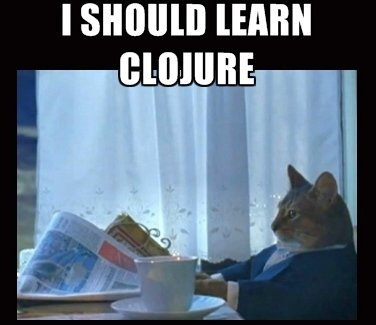
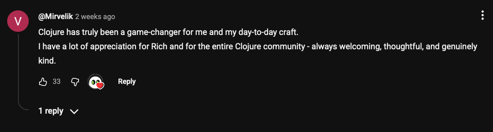
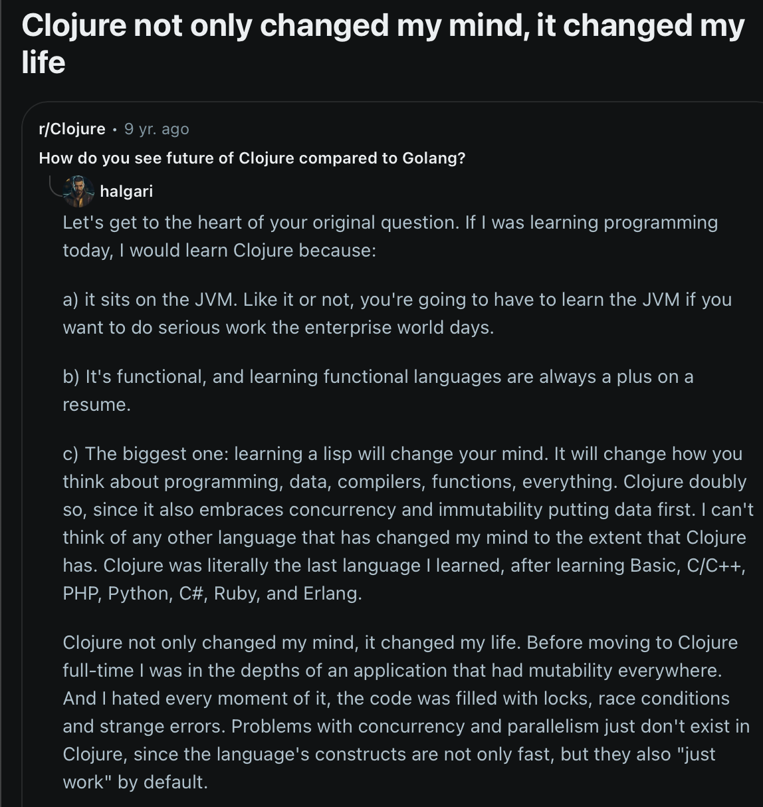
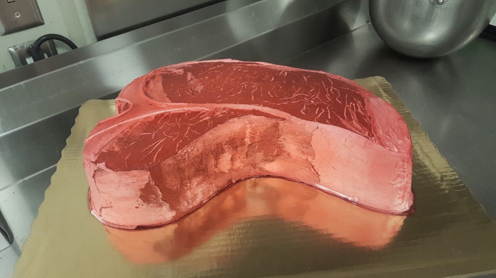

# Clojure as Your First Language: Shaping a Functional Mindset

# Wendy Randolph

 Dutch Clojure Days 2026
 Amsterdam, Netherlands

<!-- Are you ready for the last talk before lunch at Dutch Clojure Days 2026 ?!?!?!?! Ok let's do it.

Let's talk about "Clojure as My First Programming Language: Shaping a Functional Mindset" -->

---
### What this talk is
This is the story all about how my life got flipped turned upside down.

<!--
- this is a story all about how my life got flipped turned upside down...
- by learning _clojure_ as my first programming language.
- Clojure seems to have a stigma of being a hard to learn or hard to learn for beginners, language. I'd like to disrupt that stigma.
- I was doing x, I learned Clojure, now I'm a software dev and speak at conferences all over the world.
- Not only did Clojure teach me how to code, but it taught me how to think. (eh, could we say it better?)
-->
---

## What this talk is not

<!--
- not exhaustive list about why clojure is great - you're here, you probably already know. We are at a fan club right now.
- not an exhaustive argument for why clj should be your first programming language or your friend's first programming language
-->
---
[image: screenshot of comments on clojure documentary trailier]

---
<!--
- its not a novel idea, people being changed by learning and using clj - comments from clj doc
- I'm saying, this transformation is not just for senior engineers with years under their belts who then get inspired by a Rich Hickey talk.
-->

---

---

### Clojure is for me too.
<!-- "Clojure was my first language, and it didn't just teach me to code — it taught me how to think." - written by Claude. Need my own words here.
-->

---
## Act I : An Unusual Start <!-- (10 min) -->

<!-- What Happened / My Story -->

<!-- So who here wants to get real technical right off the bat? (Show of hands) OK, TECHNICALLY _Clojure_ wasn't my first programming language. but we'll get to that. I think of Clojure as my first programming language, because its the first one I took seriously and built things with. (first kiss analogy?)

Let's talk about what happened BC - before Clojure. -->
---
### Concrete Creativity: Cakes, Sewing, Dancing

[images:
couple impressive cakes
sewing related images of mine - dart or shoulder seam.
dance images]

<!-- I have a creative arts background. I like making stuff, I have for a long time. I like dancing and movement, I have for a long time. If you've observed me for any length of time, you may see me moving around more than other people. So making stuff and dance, The common denominator? I like being creative and expressing ideas in concrete ways - making stuff with my hands, or expressing something through my body. With work like this, the systems are easy to see, bc they are in front of your eyeballs. -->

---
<!-- [image: tbone steak cake] -->

<!--
Here is a cake I made several years ago. yes this is a cake.
Should I texture the cake icing before or after I airbrush the surface?... -->
---
[image: photo of shirt that has a fold from the armpit to the bust]
<!-- If I add a dart to this shirt, does that fix this wrinkle that is coming from the armpit? -->
---
[image: dance step, another dance step]

<!-- How can I transition from one dance step to the next? When I end the first sequence, which foot has my weight on it?)

Those were the systems I was accustomed to working with. Problems I was used to solving.

But the work I was getting paid to do was getting less creative.
-->
---
["what else can i do?" encanto image]
<!-- I wanted to do more, build more, make more money, have more control over my time. I just didn't know what to do yet. -->

---
[image of cakes, sewing, dancing]

<!--
Someone in my life looked at me - and my patterns - said, you should look into programming.

But, programming is for people who take computers apart and like math.

They said, "don't you take clothes apart to see how they are made?" -->

---
If there’s a scale of painting to chemistry, and programming is *
	it’s like this:

 painting—*—————————————————————————————————chemistry

<!--
"And anyway, if programming is on a scale from painting to chemistry, its more painting."

Ok, if programming is a creative endevour, I can get into that. I'll do it. I'll work towards building something (software), I'll gather skills along to way. Yeah, I'll make an app!
What is an app? A mobile app? Sure.
What programming language to make a mobile app? Hmm, I have an iphone - what language makes iphone apps? Swift. Alright, I'll learn swift! -->

---
### Started with a puzzle game

[images:
"app = mobile = iphone = swift = swift playgrounds"
personal swift playground images
computer set up]

<!-- Keep in mind, this is before widespread AI-tool usage. Heck at this point, I am even a pretty lousey googler.

I started with a game - Swift Playgrounds - not technical books or language docs.

I didn't use an editor yet - just make the little dude turn around, get gems, start / stop loops by writing Swift.

This is where I first
* felt the burn of not breaking down problems small enough and thinking through _what am i doing_ before writing.
* learned value of walking away from the computer when frustrated by a problem. take a break from trying to stop a stupid loop...

A few weeks in, I started considering Clojure - as it seemed like more well-rounded, multi-purpose language, beyond "apps". Lucky me, I knew someone who knew Clojure existed. Lucky me, I was married to them. and still am. -->

---
### The Lure of Clojure

[images:
rich hickey talk
stu halloway talk - sherlock holmes?
flypaper billboard]

<!-- Before I knew about functional programming, OOP, why Clojure was different and niche, oops, I listened to some of the famous Clojure talks by Rich Hickey and Stu Halloway.

I remember laying on my living room floor, probably frustrated with loops, listening to the sweet sound of Rich Hickey talking about thinking deeply and simplicity.

The thoughtfulness of the language drew me in even before I understood the broad concepts or ecosystem of the language.

Sure, I didn’t understand everything in these talks, but I was getting some of it. I felt like a piece of flypaper that is trying to create a picture; I don’t have enough dead bugs on me to make an image yet. But I keep near the light so more bugs will get stuck on me. and ill be able to creat a pricture.
-->

---
### Community & Resources

[images:
froggie / rubber duck
Clojure for the brave and true - screenshots of example code from scratchpad of doom
Clojure Camp folks
people thought I dove into the deep end by learning clj first]

<!-- Soon, I go full Clojure,
reading Clojure for the Brave and True, setting up emacs,
reaching out to Daniel H and Jordan M to thank them for their contributions to the Clojure community.
<< slack beginners chanel, getting intimidated and promptly fading >>
About a month after I start learning programming, those two and some other wonderful people start Clojure Camp, an online community for learning Clojure. And I join immediately.
This gave me accountability every week for continuing to build my skills and learn with others through video calls. I find my people I can grow with.
I started going to tech conferences and talking with engineers in person. More often than not, people thought I dove into the deep end with Clojure as my first language.  Hmmm... (first time getting feedabck that cojure is hard)
-->

---
### Early Struggles

[images:
blank slate / dry erase board / blank piece of paper
no baggage
rich hickey or stu saying i should have thought about it more
what is life]

<!-- I struggled, but the struggles weren't really Clojure-specific. They were programming struggles.

Being a blank slate can be a blessing and a curse.
No prior experience means no intuition to fall back on.
But also means no bad habits or baggage from x y z that I hear other folks have to deal with, coming from other paradigms.

My issues were
- becoming overhwhelmed with a problem because I was trying to do too much - didnt break it down small enough - how _do_ i break it down? guess i should have thought more deeply
- not knowing names of concepts or abstractions. (not a good googleer yet) How do I express what I am having trouble with when I don't even know what "it" is called? what is the abstraction I am struggling with? what is _abstraction_? e.g., how can i make the app i built available for people to use on the internet - what is that called? -->

---

## Act II : The Features That Made It Possible <!-- (10 min) -->

<!-- What kept me going -->

### Combo Special

[images:
Captain Planet - our powers combined]

<!-- Learning in _Clojure_ kept me going, when I might have otherwise given up on my endevour. It is not just a functional language, not just a lisp, not just a REPL (insert photo Captain Planet's "Our powers combined!") It's the combination that makes it special and the thinking that went into the design of the language. -->
---
### Minimal Syntax

[images:
The Beach at christmas - flamingo sunglasses
code sample comparison - clojure vs java
Raphie from a Christmas Story]

<!-- The minimal syntax let me have a narrower focus on the problem at hand - without regard to boilerplate or ceremony related to objects, classes, procedures. Not that I knw what those where at the time. I didn't appreciate this enough until I started writing C: declaring prototypes, preprocessor directives, int main()... makes me think of Ralphie from Christmas Story. I live in FL in the US. We have very mild winters. If I need to get milk from the store, I throw on a jacket, hop in the car, go to the store. Done. With C, its like going out into the snow - you gotta get all wrapped up in pants, coats, scarves, mittens, boots, warm the car up, de-ice the windshield, or shovel snow before you even leave the driveway - just to get some frickin milk. -->

---
### Immutability & Purity

[might add if time, maybe add into first point
because these play into simplicity and focusing on the current problem at hand - not adding unnecessary complexity]

---
### REPL Feedback Loop

[images
thousand line Emacs scratchpad from clojure camp
stu quote / screenshot]

- explore problems one small step at a time
<!--
The REPL is where I explored what core functions do, how to put them together. I could run small bits of code instantly and see what happens. I don't have to build an entire program before I learn something. I don't have to build tests first - I was barely even thinking about tests at this point! It was more of a try something > observe > adjust pattern. The repl let me do that without having to relaunch an app or compile a program to see a result. One thing I did a lot of was "eval to comment" in Emacs - it was instant, a key command, and I had results. This partially contributed to, ahem, somewhat long scratchpad files. [Austin Antecdote] What does this expression evaluate to? I think it evaulates to this. Oh yeah? prove it! More comments in my scratch pad, seeing if I could explain what each function or express was doing. This was my safe place to experiment, fail, and grow as a beginner. Turns out it served me in the future when building my first clojure web app.-->
---

<!-- Stu Halloway when asked what was something important or lesson he learned in the last 10-15 years: -->

“... the importance of an interactive environment for exploring ideas, and the importance having that environment be the same environment that you use to ship production code. If I am exploring something that is completely unknown to me, I’ll sit down and open a Clojure REPL. If I’m writing code to ship to production, I’ll work in very similar ways in much the same REPL. ” - Stu Halloway, Clojure Turns 15 video

---
## Abstract to Concrete <!-- (2-5 min) -->

<!-- well that was a lot of talking -->

stretch break transition
2-5 min

<!--
instead of thinking of a thing or idea - make it exist in the world

stretch - where does my arm go? i didnt know it could do that?

ive not felt that before. roll my wrists. wow that feels good - why dont i do this more?

stretch to the side. Oh, that kinda hurts. Maybe don't go that far this time. Maybe bend my knees this time. what if i keep my hips centered this time.

So i need to isolate this section in order for this section to move better... hmm im feeling another clojure talk coming on. we better sit down.
-->

<!--
The simplicity, immutablity, purity, repl feedback - these are things I experienced while learning Clojure and programming at the same time. These things help beginners as well as senior devs, if not more so. I didn't realize I had entered into a philosphy of how to _think_. But thats exactly what I did.
-->
---

## Act III : What Stuck / What Remains / What Mindset remains? <!-- (10 min) -->

[images
mindset definition
functional definition]

<!-- TODO:
- section needs refinement
- does slides2.md outline provide any substance to add here?
- is anything left unresolved from above?
    - you dove into the deep end learning clojure early. -->

<!-- what remains? If I never wrote code again, if I never build software again...
Lets define functional
Let's define mindset
-->
---

### Name! That! Problem!

[image
name that problem like a game show segment
a1 - something related to naming problem statement
data model list of questions?
]

<!--
name your problem. form a great problem statement. what do you need? am i adding in unneccesary complexity to this problem?
- talks from rich, stu - examples
- talking to a person about a problem
- talking to an LLM about a problem
- maybe mention specific data model development for elixir projects -->
---
### REPL Habit / Inspecting / what is this value?

[images:
swimsuit product photo
swimsuit inside out - problem revealed - stupid backwards liner
]

<!-- That REPL habit... Breaking something down to check each piece before trusting the whole. I found myself doing that recently with a recent online shopping spree. I bought several swimsuits in different styles and sizes. There was one that fit mostly well and looked decent, but there was something wrong. Maybe it was me. Stop, and try again another day without context of the other suits. Try it on, still wrong, but why? Looks fine. What are the symptoms? too high in the back, too low in the front... could it be backwards... turn it inside out.. ah HA! It wasn't my imagination. The liner was sewn on backwards. (photo) - bc im a seamstress. - combined with pre-existing domain knowledge is a super power. It wasn't until I inspected the value and proved to myself the problem, the solution then bcame clear. Return that crap back to amazon. -->

---

<insert elxir iex inspect example >

<!-- I'm working alot in Elixir right now, and when I jumped into my first production project. I recall missing the repl. I need a way to see what this variable is now on this page render - what is being passed in here? iex is the interactive elixir env. what is assigned here? what is the shape of the data? -->

---
### Immutability / What is true right now? / combine this one with the Repl?

[images laundry - dirty? clean and ready for dryer?]

<!-- I often find myself using a word I never used before in this way: state. As in, what is the state of the world right now? As in, what do we have? what do we know? what is true now? I'll often think of this when trying to ask my husband about something like laundry... Hey honey, What is the state of the laundry in the washer? And he'll say "Florida!" Because, thats the state, we are in. And I'll sigh, bc he's being a smart alec and he knows what I mean!
-->

---
### Maybe another slide with another lesson - look to abstract ?
<!--
<insert awesome transition>
-->
---
## Placeholder : Fantastic Closing
<!--

< insert awesome closing here >

there is no one right way to clojure
whether you are beginner with no prog experience, or senior dev,
clojure is still for you
lets not keep people from clojure. its 2026.
isn't it time we let everyone who wants in?

- If you are here and think Clojure is great but not for beginners, _or_ if you've never given it a second thought,
- I hope you'll be able to see that learning Clojure early in your career is possible and valuable - because I am living proof of that.

maybe there are people listening to me now who have discounted their path to Clojure or programming bc it wasn't "traditional."
Do not discount it. Your path here is yours and I'm going to own my path to programming, even with my 3,000 line scratchpads.

Thank You

the end?

------

needs refinement, something in here smells like AI : "I am a person whose mind was shaped by Clojure from day one, with no prior programming habits to unlearn." That was significant enough for me to travel over 7,000 km to share with you today. Thank you. -->